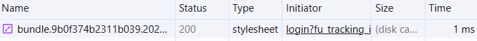
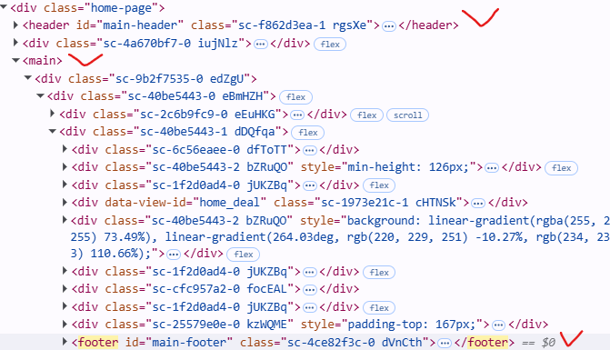
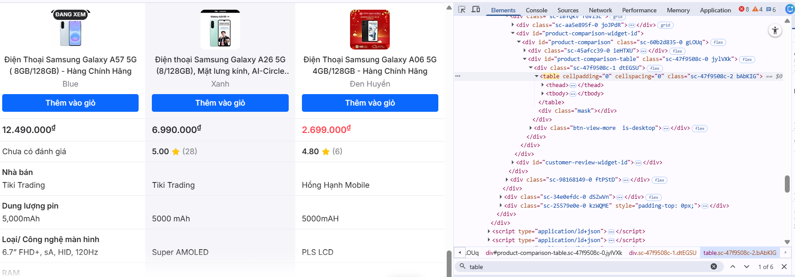

# Câu A1 - HTTP & Browser (Nguồn tham chiếu : 01_introduction_html_universe.md)
1. Khi em gõ https://shopee.vn vào trình duyệt và nhấn Enter, hãy liệt kê đúng thứ tự ít nhất 5 bước xảy ra (từ DNS lookup đến render).
 * Gõ https://shopee.vn -> Enter 
    - DNS Lookup: đổi shopee.vn → địa chỉ IP  
    - TCP handshake: tạo kết nối với server  
    - TLS handshake: mã hóa (HTTPS)  
    - Gửi HTTP request  
    - Server trả về response (HTML)  
    - Trình duyệt tải thêm CSS, JS  
    - Render và hiển thị trang  

2. Trong DevTools của Chrome, tab Network cho thấy thông tin gì? Hãy mở một trang web bất kỳ, chụp screenshot tab Network và đánh dấu (vẽ mũi tên/khoanh tròn) vào:
 * Tab Network cho thấy :
    - Danh sách các request(Name) có đuôi như js,html,css và ảnh
    - Status code (200 = OK, 404 = lỗi không tìm thấy, 500 = lỗi server)
    - Type(Các loại file (html,css,js))
    - Initiator: Request được gọi bởi ai
    - Size(dung lượng file tải về )
    - Time(Thời gian load request)
 * Hình chụp
    - Status Code của request đầu tiên 
    - Tổng thời gian load trang 
    - Một request trả về file CSS 

# Câu A2 (5đ) — Semantic HTML (Nguồn tham chiếu : 04_visible_part_html.md)

```html
<div class="header">
    <div class="logo">ShopTLU</div>
    <div class="menu">
        <div><a href="/">Trang chủ</a></div>
        <div><a href="/products">Sản phẩm</a></div>
    </div>
</div>
<div class="main">
    <div class="product">
        <div class="title">iPhone 16 Pro</div>
        <div class="price">25.990.000đ</div>
        <div class="image"></div>
    </div>
</div>
<div class="footer">© 2026 ShopTLU</div>
```

 * Mẫu trang web như trên bị  Google đánh giá SEO thấp là vì sử dụng quá nhiều thẻ `<div>`  không có ý nghĩa ngữ nghĩa.Cụ thể:
    - Không dùng thẻ `<header>`, `<nav>`, `<main>`, `<footer>` → Google khó hiểu cấu trúc trang  
    - Menu không dùng `<nav>` → không rõ đây là thanh điều hướng  
    - Tiêu đề sản phẩm không dùng thẻ heading (`<h1>`, `<h2>`)  
    - Ảnh không có thuộc tính `alt` → không tốt cho SEO  
    - Thông tin sản phẩm không được đánh dấu rõ ràng (thiếu semantic)

 * Code đã sửa
 
 ```html
<header>
    <h1>ShopTLU</h1>
    <nav>
        <a href="/">Trang chủ</a>
        <a href="/products">Sản phẩm</a>
    </nav>
</header>

<main>
    <article class="product">
        <h2>iPhone 16 Pro</h2>
        <p class="price">25.990.000đ</p>
        
    </article>
</main>

<footer>
    <p>© 2026 ShopTLU</p>
</footer>
```
# Câu A3 (5đ) — Block vs Inline

```html
<div>Hộp 1</div>
<span>Text A</span>
<span>Text B</span>
<div>Hộp 2</div>
<span>Text C</span>
<strong>Text D</strong>
<div>Hộp 3</div>
```
 * Mô tả theo text art
 Hộp 1
 Text A Text B
 Hộp 2
 Text C Text D 
 Hộp 3

  * Giải thích:
    - `<div>` : là Block element,chiếm toàn bộ dòng và luôn xuống dòng riêng
    - `<span>` và `<strong>` : là Inline element,hiển thị cùng dòng , nằm cạnh nhau (`<strong>` với mục đích để nhấn mạnh)

# Câu A4 (5đ) — Table (Nguồn tham chiếu : 05_tables_hyperlinks.md)

 * Sự khác nhau giữa `<thead>`,`<tbody>`, `<tfoot>` là :
    - `<thead>`: chứa phần tiêu đề của bảng (header)  
    - `<tbody>`: chứa nội dung , dữ liệu chính của bảng  
    - `<tfoot>`: chứa phần chân bảng (tổng kết, ghi chú) 
 * Ta không nên dùng table để tạo layout cho trang web là vì:
    - `<table>` dùng cho dữ liệu dạng bảng, không phải để chia bố cục  
    - Lồng nhiều table làm code dài và khó sửa  
    - Google khó hiểu cấu trúc trang  

# Câu B3
 * Lỗi 1: DOCTYPE sai
    - Dòng 1 — `<!DOCTYPE>` thiếu chuẩn HTML5
    - Sửa: `<!DOCTYPE html>`
 * Lỗi 2: meta charset sai
    - Dòng 4 — utf8 sai chuẩn
    -  Sửa: UTF-8
 * Lỗi 3: thiếu đóng thẻ title
    - Dòng 4–5 — `<title>` chưa đóng
    - Sửa: thêm `</title>`
 * Lỗi 4: h1 sai cú pháp
    - Dòng 8 — `<h1>` không đóng đúng
    - Sửa: `<h1>...</h1>`
 * Lỗi 5: link sai cú pháp
    - Dòng 12 — `<a href="home">` thiếu # + thiếu đóng thẻ
    - Sửa: `<a href="#home">...</a>`
* Lỗi 6: ảnh thiếu alt + sai chuẩn
    - Dòng 19 — thiếu alt và quotes
    - Sửa: src="iphone.jpg" alt="iPhone"
 * Lỗi 7: thẻ b sai đóng
    - Dòng 21 — `<b>` và `</b>` sai vị trí
    - Sửa: `<b>25.990.000đ</b>`
 * Lỗi 8: thiếu đóng thẻ p
    - Dòng 35 — `<p>`Copyright 2026 chưa đóng
    - Sửa: `</p>`
 * Lỗi 9: dùng 2 thẻ main (semantic sai)
    - Dòng 38 — chỉ được 1 `<main>`
    - Sửa: đổi main thứ 2 thành `<aside>`
 * Lỗi 10: thiếu lang trong html
    - Dòng 2 — `<html>` thiếu lang
    - Sửa: `<html lang="vi">`

# Câu B4
Chọn Tiki.vn
1. 3 thẻ semantic HTML5 mà trang đó sử dụng là:thẻ `<header>` ,`<main>`,`<footer>` đều nằm trong thẻ `<div class="Home-page">` 
2. Mở tab Elements, tìm 1 <table> trên trang. Chụp screenshot và trả lời:
- Table đó hiển thị nội dung ảnh điện thoại,giá tiền,thông số chi tiết ,so sánh giữa các diện thoại 
- Có sử dụng `<thead>`,`<tbody>`
- link ảnh : 

# Câu C1  — Thiết kế cấu trúc

```html
<!DOCTYPE html>
<html lang="vi">

<head>
    <meta charset="UTF-8">
    <title>Trang bán sản phẩm</title>
</head>

<body>

    <header> 
        <!-- header vì đây là phần đầu trang, chứa logo + thanh điều hướng -->
        
        <nav> 
            <!-- nav vì đây là khu vực điều hướng chính của website -->
        </nav>
    </header>


    <nav aria-label="breadcrumb"> 
        <!-- nav vì đây là điều hướng phụ (breadcrumb) -->
        <!-- aria-label giúp hỗ trợ accessibility -->
        
        <ol>
            <!-- ol vì breadcrumb có thứ tự rõ ràng -->
            
            <li><a href="/">Trang chủ</a></li>
            <!-- li vì mỗi bước trong breadcrumb là một mục -->
            
            <li><a href="/dien-thoai">Điện thoại</a></li>
            <li>iPhone 16</li>
        </ol>
    </nav>


    <main> 
        <!-- main vì đây là nội dung chính của trang -->

        <section class="product-gallery">
            <!-- section vì nhóm nội dung ảnh sản phẩm có chức năng riêng -->
            
            <figure>
                <!-- figure vì chứa nội dung hình ảnh sản phẩm -->
                
            </figure>

            <div class="thumbnail-list">
                <!-- div vì chỉ là nhóm layout ảnh nhỏ -->
                
                
                
                
            </div>
        </section>


        <section class="product-info">
            <!-- section vì đây là khối thông tin sản phẩm -->

            <h1>Tên sản phẩm</h1>
            <!-- h1 vì là tiêu đề chính của trang sản phẩm -->

            <p class="price">Giá sản phẩm</p>
            <!-- p vì đây là đoạn thông tin văn bản -->

            <div class="rating">
                <!-- div vì nhóm hiển thị đánh giá sao -->
            </div>

            <p class="description">
                <!-- p vì mô tả sản phẩm là đoạn văn -->
            </p>
        </section>


        <section class="specifications">
            <!-- section vì đây là khu vực thông số kỹ thuật -->

            <table>
                <!-- table vì dữ liệu dạng bảng -->
                
                <thead>
                    <!-- thead vì chứa tiêu đề bảng -->
                    <tr>
                        <th>Thông số</th>
                        <th>Giá trị</th>
                    </tr>
                </thead>

                <tbody>
                    <!-- tbody vì chứa dữ liệu chính -->
                    <tr>
                        <td>CPU</td>
                        <td>5 nhân</td>
                    </tr>
                </tbody>
            </table>
        </section>


        <section class="reviews">
            <!-- section vì đây là khu vực đánh giá/bình luận -->

            <article>
                <!-- article vì mỗi bình luận là một nội dung độc lập -->
                <p>Bình luận người dùng</p>
            </article>
        </section>

    </main>


    <aside>
        <!-- aside vì đây là nội dung phụ (sidebar) -->

        <section class="related-products">
            <!-- section vì nhóm sản phẩm liên quan -->
            <h2>Sản phẩm tương tự</h2>
        </section>

    </aside>


    <footer>
        <!-- footer vì đây là phần cuối trang -->

        <p>Thông tin bản quyền</p>
    </footer>

</body>

</html>
```

# Câu C2 (10đ) — So sánh & Tranh luận

Quan điểm “dùng `<div>` cho mọi thứ rồi gắn class là đủ, không cần semantic HTML.Tốn thời gian học thẻ mới” là chưa hợp lý nếu xét về chất lượng kỹ thuật và khả năng mở rộng của hệ thống website.Thứ nhất, về SEO (Search Engine Optimization), các thẻ semantic như `<header>`, `<main>,` `<article>`, `<section>` sẽ giúp công cụ tìm kiếm hiểu rõ cấu trúc nội dung. Ví dụ, Google ưu tiên nội dung trong  như `<main>` hoặc `<article>` hơn so với các khối `<div>` không có ngữ nghĩa. Nếu toàn bộ trang chỉ dùng `<div>`, crawler sẽ khó phân biệt đâu là nội dung chính, đâu là sidebar.Điều này dẫn đến việc giảm hiệu quả indexing.Thứ hai, về Accessibility (khả năng tiếp cận), các công cụ đọc màn hình (screen reader) dựa vào semantic HTML để “đọc” trang cho người khiếm thị. Ví dụ, `<nav>` cho biết đây là khu vực điều hướng, giúp người dùng có thể nhảy nhanh,cuộn xuống giữa các menu mà không cần đọc toàn bộ trang. Nếu chỉ dùng `<div>`, người dùng phải nghe toàn bộ nội dung một cách rời rạc, gây ra trải nghiệm rất kém.Ví dụ cụ thể: một trang tin tức sử dụng `<article>` cho mỗi bài viết giúp screen reader hiểu từng bài chính là một đơn vị độc lập. Người dùng có thể “skip” giữa các bài nhanh chóng. Nếu chỉ dùng `<div class="post">`, chức năng này phải phụ thuộc hoàn toàn vào class tùy chỉnh, không được hỗ trợ mặc định bởi trình đọc màn hình.Tuy nhiên, thẻ `<div>` vẫn phù hợp trong nhiều trường hợp, đặc biệt khi chỉ cần tạo layout hoặc nhóm phần tử phục vụ CSS/JS mà không mang ý nghĩa nội dung, ví dụ như container chia cột `(<div class="grid">)` hoặc wrapper cho animation.


 


 


